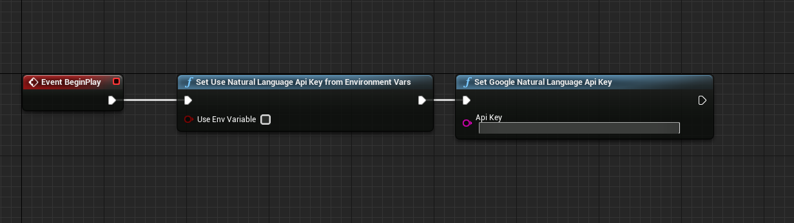

# **UE4 Google natural Language API**

This is UE4 wrapper for Google's [Natural Language API](https://cloud.google.com/natural-language#natural-language-api-demo).

This plugin allows you to derive insights from unstructured text using Google machine learning.

# Preparation
1) Go to [google cloud](https://console.cloud.google.com) and create payment account.
2) Enable [Cloud Natural Language API](https://console.cloud.google.com/apis/library/language.googleapis.com).
3) Create credentials to access your enabled APIs. See instructions [here](https://cloud.google.com/docs/authentication).

4) There are two ways how you can use your credentials in project.

    * 4.1 By using environment variables. Create environment variable `GOOGLE_API_KEY` with created key as value.

    * 4.2 By assigning key directly in blueprints. This can be called anywhere.

    

    By default you need to set api key from nodes. To use environment variable, you need to set `Use Env Variable` to `true`.

> **ADVICE**: Pay attention to security and encrypt your assets before packaging.

# Blueprint nodes

Following async nodes represents [API methods](https://cloud.google.com/natural-language/docs/reference/rest/v1beta2/documents).

## Analyze entities

Finds named entities (currently proper names and common nouns) in the text along with entity types, salience, mentions for each entity, and other properties.

## Analyze sentiment

Analyzes the sentiment of the provided text.

## Analyze syntax

Analyzes the syntax of the text and provides sentence boundaries and tokenization along with part of speech tags, dependency trees, and other properties.

## Classify text

Classifies a document into categories.

## Other nodes

This nodes represents data structures and intended to be used for requests creation and
response parsing.

# Platforms supported

**Windows**, **Mac**, **Android**

# Links
Find out more in documentation for corresponding sections.
* [API methods documentation](https://cloud.google.com/natural-language/docs/reference/rest/v1beta2/documents#type)
* [Language support for each API method](https://cloud.google.com/natural-language/docs/languages)
